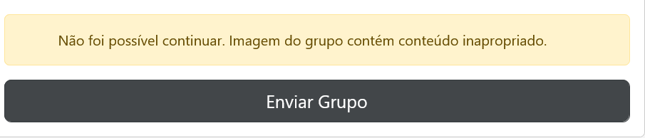

<div align="center">
    
</div>

Este projeto foi inspirado no site: [gruposwhats.app](https://gruposwhats.app)
_____

### 📗 Navegação:

- [Dependências](#dependencias)
- [Google reCAPTCHA](#reCAPTCHA)
- [Banco de dados](#database)
- [Web Scraping](#webscraping)
- [Moderação de conteúdo inapropriado usando IA.](#nsfw)
- [Demonstração](#demo)
_____

<a id="dependencias"></a>

### 📖 Dependências utilizadas:

Execute o comando ``composer install`` para instalar todas as dependências utilizadas neste projeto.

| Nome | Versão |
| --- | --- |
| **[coffeecode/router](https://packagist.org/packages/coffeecode/router)**| ^2.0 |
| **[twig/twig](https://packagist.org/packages/twig/twig)**| ^3.6 |
| **[vlucas/phpdotenv](https://packagist.org/packages/vlucas/phpdotenv)** | ^5.5 |

É necessário ter o [composer](https://getcomposer.org/download/) instalado.
_____

**Importante:** Modifique a URL da aplicação no arquivo [**.env**](https://github.com/HenriqueCacerez/divulgazap/blob/main/.env) e em [general.js](https://github.com/HenriqueCacerez/divulgazap/blob/main/public/assets/js/general.js)
_____

### PHP:

Este projeto é baseado em PHP no seu back-end, utilizando orientação a objetos e seguindo o padrão MVC (Model, View e Controller).

_____

<a id="reCAPTCHA"></a>

### reCAPTCHA:
Foi utilizado o [Google reCAPTCHA](https://www.google.com/recaptcha/about/) no formulário de cadastro para mitigar ataques automizados a aplicação.

você pode facilmente definir as suas credenciais no arquivo [**.env**](https://github.com/HenriqueCacerez/divulgazap/blob/main/.env)

```bash
reCAPTCHA_public_key = "YOUR_SITE_KEY"
reCAPTCHA_secret_key = "YOUR_SECRET_KEY"
```

_____

<a id="database"></a>

### Banco de Dados (MySQL):

Importe o arquivo [divulgazap.sql](https://github.com/HenriqueCacerez/divulgazap/blob/main/divulgazap.sql) em seu banco de dados.

Defina as credenciais de conexão no arquivo [**.env**](https://github.com/HenriqueCacerez/divulgazap/blob/main/.env)

```bash
# MySQL Database Connection #
DB_DRIVER=mysql
DB_HOST=localhost
DB_PORT=3306
DB_NAME=divulgazap 
DB_USER=root
DB_PASS=
```

Todo acesso ao banco de dados foi implementado utilizando [PDO](https://www.php.net/manual/pt_BR/book.pdo.php) com prepared statements.
_____

<a id="webscraping"></a>

### Web Scraping:

Foi utilizado a função nativa [file_get_contents](https://www.php.net/manual/en/function.file-get-contents.php) para coletar o conteúdo HTML da página de convite do WhatsApp 

``https://chat.whatsapp.com/{id}``

Em seguida, foi utilizado [preg_match_all](https://www.php.net/manual/en/function.preg-match-all.php) para filtrar somente os dados relevantes através do uso de expressões regulares:

| Informação | Expressão Regular |
| --- | --- |
| **Nome do Grupo** | `/<h3 class="_9vd5 _9scr" style="color:#5E5E5E;">(.*?)<\/h3>/s` |
| **URL da Imagem** | `/</a>

### NSFW (Inteligência Artificial):

A identificação de conteúdo com nudez em imagens de grupos do WhatsApp é realizada por meio da inteligência artificial da [Imagga](https://docs.imagga.com/?php#personal_photos-categorizer).

No momento final do cadastro, a URL da imagem do grupo é enviada para a **Imagga** via [cURL](https://www.php.net/manual/pt_BR/ref.curl.php).

A plataforma analisará a imagem e fornecerá uma classificação denominada '**safe**', acompanhada de um valor de '**confidence**', representando a porcentagem que indica o quão "segura" a imagem é.

É possível ajustar o nível de rigorosidade, modificando o valor na classe [**NotSafeForWorkService.php**](https://github.com/HenriqueCacerez/divulgazap/blob/main/App/Services/NotSafeForWorkService.php)

```php
    const MINIMUM_SAFE_CONFIDENCE = 65;
```



Quanto maior for o valor definido, maior será a rigorosidade para a aprovação do grupo.

Você pode definir as suas credenciais da Imagga no arquivo [**.env**](https://github.com/HenriqueCacerez/divulgazap/blob/main/.env):

```bash
    ## Imagga
    IMAGGA_API_KEY    = "YOUR_API_KEY"
    IMAGGA_API_SECRET = "YOUR_API_SECRET"
```

_____

<a id="demo"></a>

### Demonstração:

<div align="center">
    
</div>

_____

### Você é muito bem-vindo(a) para contribuir com este projeto

Faça um fork do repositório e submeta um pull request com as alterações propostas =)